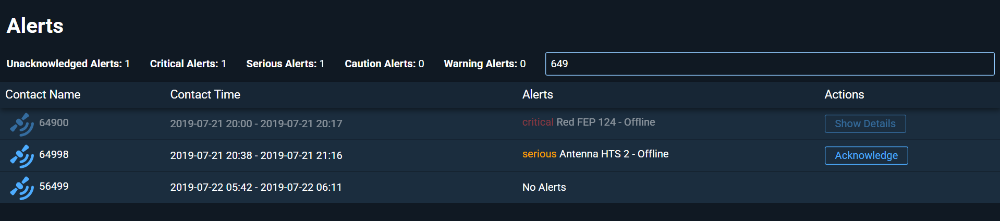

# GrmDashboard

This project is a Ground Resources Management (GRM) Alert Dashboard that displays satellite alerts from a JSON data source.



## Installation & Setup

### Clone the Repository

```bash
git clone https://github.com/AdamBaugher/RocketCommunications-Take-Home-Challenge.git
cd RocketCommunications-Take-Home-Challenge
```

### Install Dependencies

```bash
npm install
```

### Run the Applicatoin

```bash
npm start
```

### Open in Browser

Navigate to: http://localhost:4200/

## Features

#### - **HTTP Request Handling**: Alerts are fetched using `HttpClient` from `assets/data.json`, maintaining flexibility for future backend integration.
#### - **Sorting by Latest Alert Time**: Data is automatically sorted based on the most recent alert for better visibility.
#### - **Interactive Table**: Alerts are displayed in a structured table with key details.
#### - **Acknowledgment & Details View**: Users can acknowledge alerts or view detailed information by clicking the respective buttons.
#### - **Search Functionality**: Supports filtering contacts based on contact name or alert message for quick access to relevant alerts.
